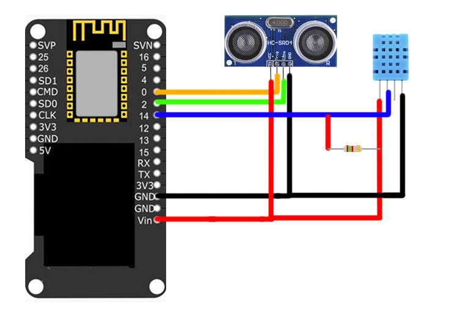
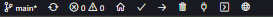
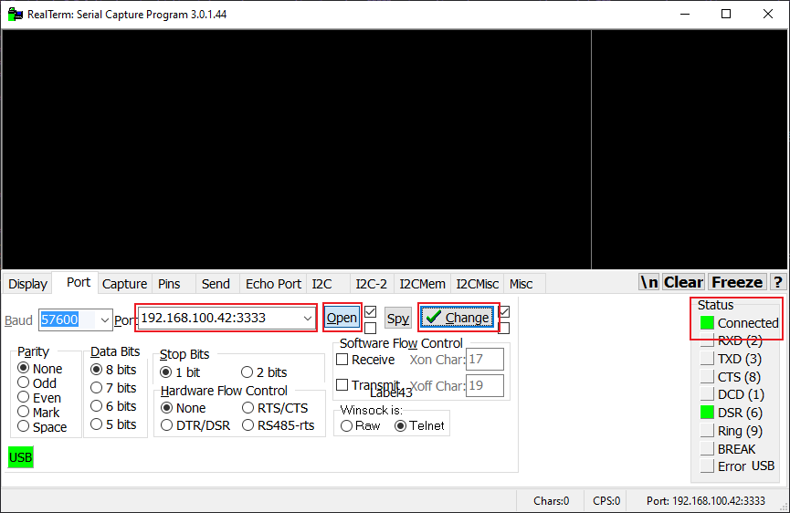
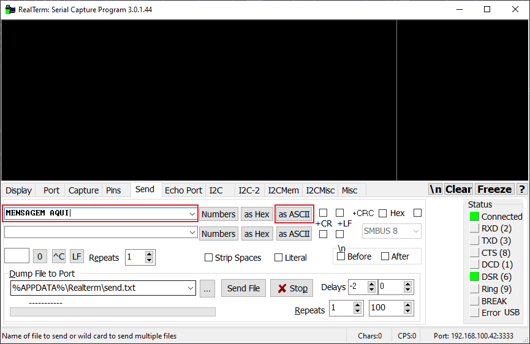
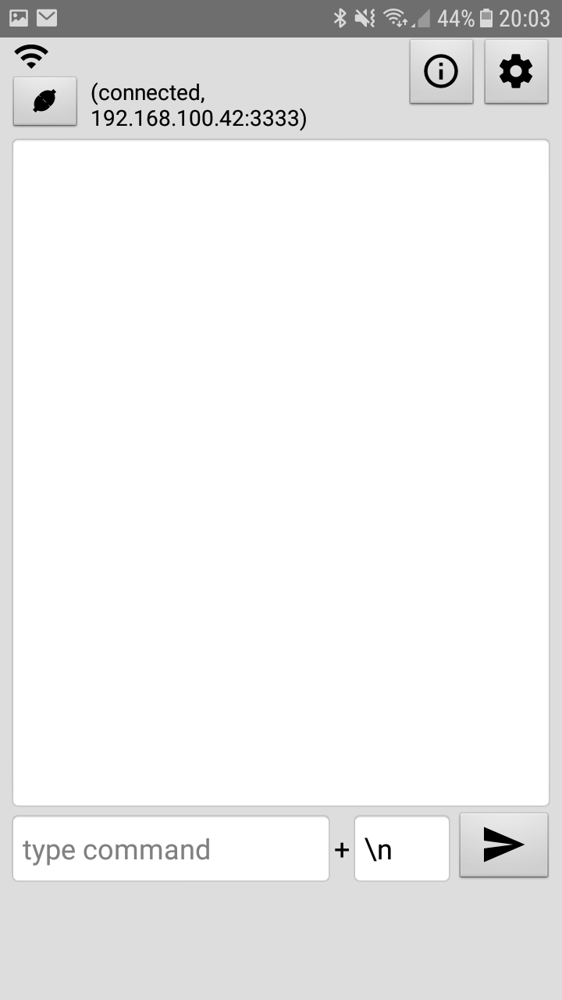
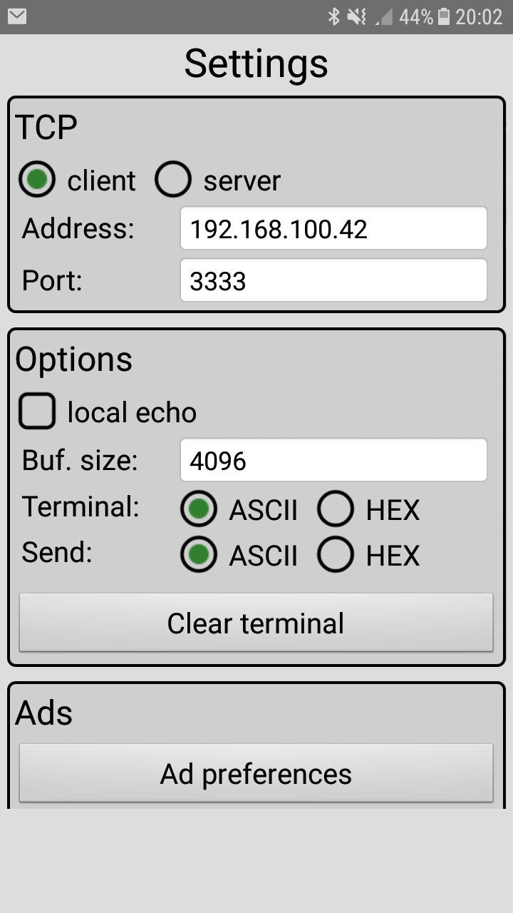

# Socket TCP Server
## Projeto de IoT Aplicada cujo objetivo é desenvolver uma aplicação onde o ESP32 seja configurado como um servidor socket TCP em uma porta específica e que um terminal de cliente possa conectar neste servidor e requisitar as informações de Temperatura, Umidade e Distância dos sensores utilizados.

### Curso: [Engenharia de Computação - UNISATC](https://web.satc.edu.br/graduacao/engenharia-da-computacao/)
### Disciplina: IoT Aplicada
### Professor orientador: [Vagner Rodrigues](https://github.com/vagner-rodrigues)
### Acadêmicos: [Christian Warmling](https://github.com/ChrisWarmling) e [Leonardo Bagio](https://github.com/LeonardoBagio)

### Requisitos:
- [ESP-IDF](https://docs.espressif.com/projects/esp-idf/en/latest/esp32/get-started/index.html)
- Extensão [PlatformIo](https://platformio.org/install/ide?install=vscode) para Visual Studio Code
- [Realterm](https://realterm.sourceforge.io/) para computador ou [TCP Terminal](https://play.google.com/store/apps/details?id=com.hardcodedjoy.tcpterminal&hl=pt-BR) para Android
- Wemos ESP32 LoLin
- Sensor de Umidade e Temperatura - DHT11
- Sensor Ultrassônico de distância

### Montagem do circuito

### Preparação e execução do projeto
1. Abra o projeto utilizando a ferramenta PlatformIo, feito isso aparecerá alguns íncones a mais na barra inferior . 
2. Clique nos respectivos ícones , o primeiro para fazer a compilação da aplicação e após terminado o processo clique no segundo para gravar no esp32.
3. Para ver o ip, porta e outras informações basta clicar em .
4. Abra o Realterm e informe o ip e porta que está rodando a aplicação
    1. Clique em `open`
    2. Clique em `change`
    3. Verifique no `status` a conexão

5. Vá na aba send
    1. Escreva o comando que desejar
    2. Aperte em `as ASCII`

### Comandos da aplicação

<table>
    <tr>
        <th>Opção</th>
        <th>Comando</th>
    </tr>
    <tr>
        <td>Temperatura</td>
        <td>TEMP</td>
    </tr>
    <tr>
        <td>Umidade</td>
        <td>UMID</td>
    </tr>
    <tr>
        <td>Distância</td>
        <td>DIST</td>
    </tr>
</table>

### TCP Terminal
Configure o ip e porta clicando no ícone de engrenagem

 